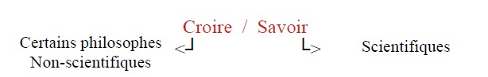
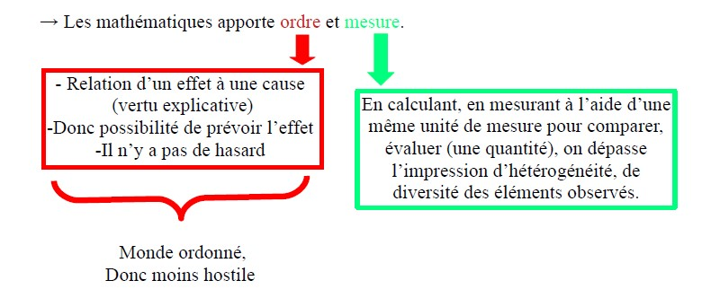
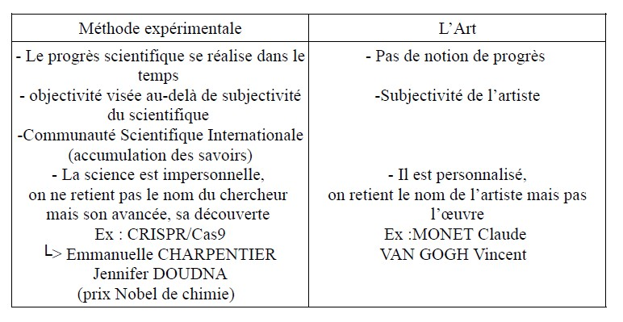
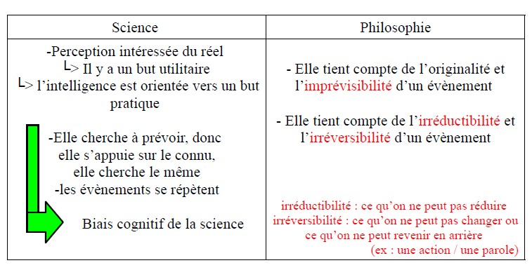
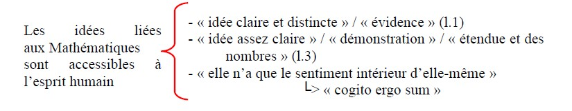
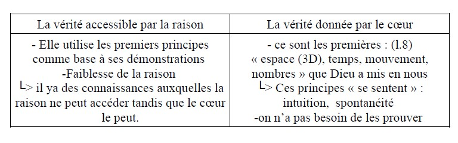
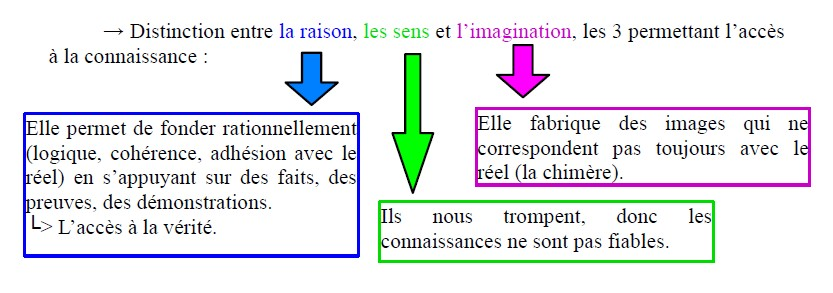
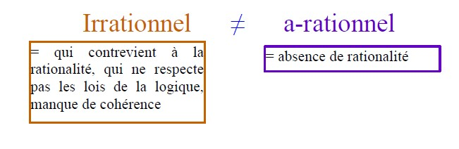
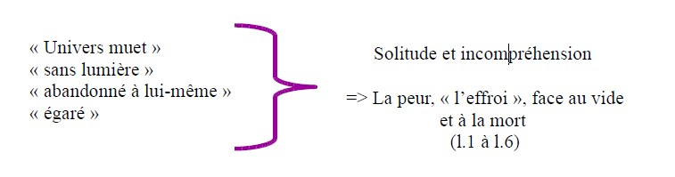

<html>
 <head>
    <meta charset="utf-8"/>
    <link href="style.css" rel="stylesheet" type="text/css"/>
 </head>
 <body>
 <h1 id="para1">QUELLE EST LA DIFFÉRENCE ENTRE LA SCIENCE ET LA CROYANCE?</h1>
 <h2 id="para2">Quel est l’objet de la science?</h2>
 <h2 id="para2">Quelles sont les limites de la science?</h2>
  
  
 
 &nbsp;&nbsp; &nbsp;&nbsp;Les tentatives d’explication des phénomènes et du réel a semblé nécessaire à l’Homme pour se sentir moins étranger dans un monde inconnu, hostile.
  &nbsp;&nbsp; &nbsp;&nbsp;&nbsp;&nbsp; &nbsp;&nbsp; => Religions, mythologies, croyances
 
  
  
 
<u><b>LUCRÈCE, <i>De la nature des choses, II</i>, Iesiècle avant J.-C.(p. 396)</b></u>

     <button type="button" class="collapsible">
<b>LUCRÈCE</b>,<i>De la nature des choses, II</i>, La science commence-t-elle là où finit la superstition?
 </button>

 

   
<i>Dans l’imagination superstitieuse, les phénomènes naturels ne sont pas des phénomènes mais des signes divines dont l’homme est le destinataire. La superstition se présente en effet la nature comme l’écritoire des volontés des dieux, et elle imagine que l’homme en est le centre. Cette imagerie demande toutefois de faire abstraction non seulement des ratés de la nature (un enfant qui naît aveugle, par exemple) mais encore des fléaux qui frappent l’homme (tels les épidémies ou les tremblements de terre). La science met-elle fin à l’ignorance dont se nourrit la superstition ?</i>
  
  &nbsp;&nbsp; &nbsp;&nbsp;&nbsp;&nbsp; &nbsp;&nbsp; Certaines philosophes ignorants des propriétés de la matière, sont d’avis que <mark id="m1"> la</mark>
   &nbsp;&nbsp; &nbsp;&nbsp;&nbsp;&nbsp; &nbsp;&nbsp; <mark id="m1">nature ne pourrait, sans l’intervention des dieux, s’accommoder si harmonieusement</mark>
  &nbsp;&nbsp; &nbsp;&nbsp;&nbsp;&nbsp; &nbsp;&nbsp; <mark id="m1">aux besoins des hommes</mark> pour varier les saisons, produire les moissons, ouvrir
  &nbsp;&nbsp; &nbsp;&nbsp;&nbsp;&nbsp; &nbsp;&nbsp; enfin aux mortels toutes ces voies où les engage et les conduit lui-même ce guide 
  5&nbsp;&nbsp;&nbsp;&nbsp; &nbsp;&nbsp; de la vie, le divin <b>P</b>laisir, qui par l’attrait des œuvres de Vénus, les invite à se reproduire
  &nbsp;&nbsp; &nbsp;&nbsp;&nbsp;&nbsp; &nbsp;&nbsp;  pour empêcher la mort du genre humain. <mark id="m1"> Imaginer que l’intérêt des mortels </mark>
   &nbsp;&nbsp; &nbsp;&nbsp;&nbsp;&nbsp; &nbsp;&nbsp; <mark id="m1">a guidé les dieux dans la création du monde</mark>, c’est en tout point, ce me semble, s’égarer
  &nbsp;&nbsp; &nbsp;&nbsp;&nbsp;&nbsp; &nbsp;&nbsp; bien loin de la vérité. Pour moi, j’ai beau ignorer ce que sont les principes des choses,
  &nbsp;&nbsp; &nbsp;&nbsp;&nbsp;&nbsp; &nbsp;&nbsp; j’oserais pourtant, et sur la simple étude des phénomènes célestes, et sur bien d’autres
  10&nbsp;&nbsp; &nbsp; faits encore, soutenir et démontrer que <mark id="m1"> le monde n’a nullement été créé pour nous</mark>
   &nbsp;&nbsp; &nbsp;&nbsp;&nbsp;&nbsp; &nbsp; <mark id="m1">par une volonté divine : tant il se présente entaché de défauts</mark> !

 
 

   

  
<u><mark id="m5">Repère : Savoir ≠ Croire</mark></u>

 
<mark>De la ligne 1 à 6:</mark>&nbsp;&nbsp; &nbsp;&nbsp;→ Nombreux philosophes qui ne sont pas scientifiques pensent que la Nature a été créée par la divinité pour les Hommes.

 
<mark>De la ligne 6 à 11:</mark>&nbsp;&nbsp; &nbsp;&nbsp;→Le monde ne peut être une création des dieux puisqu’il n’est pas parfait.

 
  

 
&nbsp;&nbsp; &nbsp;&nbsp;→ « Principe des choses » = leur origine
  &nbsp;&nbsp; &nbsp;&nbsp;Lucrèce a étudié l’astronomie (catastrophe naturelle, malformations, maladies / virus, …)
   
 
<u><b>Claude BERNARD, <i>Introduction à l’étude de la médecine expérimentale</i>, XIXesiècle (p. 398)</b></u>

     <button type="button" class="collapsible">
<b>Claude BERNARD</b>,<i>Introduction à l’étude de la médecine expérimentale</i>, Les croyances religieuses sont-elles un frein à la recherche scientifique?
 </button>
 

 

  

   
 
<mark>De la ligne 1 à 11:</mark>&nbsp;&nbsp; &nbsp;&nbsp;Le progrès de la science a lieu grâce à l’expérimentation, c’est-à-dire à la dissection (ouverture d’un corps mort pour analyser) des cadavres mais également à la vivisection (expérience sur des animaux ou humains vivants) des vivants, en vue de comprendre « les mécanismes de la vie » (l.10)

  
<b><i>Étymologies :</i>
   ⨝Dissection : du latin « dissecare » = couper en deux (secare = couper / découper)
   ⨝Vivisection : du latin « vivisectio »= découper du vivant (vivus = virus / vivant)</b>

  
<mark>De la ligne 12 à 24:</mark>&nbsp;&nbsp; &nbsp;&nbsp;→ Arguments d’autorité:
  <ul style="list-style-type:lower-alpha">
     <li>
Dans l’histoire, on a déjà pratiqué la vivisection (les rois de Perse) sur les condamnés à la mort.
</li>
     <li>
Galien, (système cardio-vasculaire, respiratoire, digestif et nerveux) au IIIe siècle, a pratiqué la vivisection sur les animaux.
</li>
     <li>
Défense de la vivisection actuelle (au XIXe siècle) : on provoque une défaillance sur l’organe pour comprendre son importance entier.
</li>
 </ul>
 <h1 id="h1">« D’autres l’ont fait, faisons le ... »</h1>
   
 
<mark>De la ligne 25 à 30:</mark>&nbsp;&nbsp; &nbsp;&nbsp;→Dénonciation des  préjugés que l’on a sur la vivisection.
  Pré-jugement : établir un jugement avant de savoir
  &nbsp;&nbsp; &nbsp;&nbsp;→Tradition religieuse de respect des cadavres.
  &nbsp;&nbsp; &nbsp;&nbsp;→Par la pathologie, par l’absence de l’organe, on peut déduire comment celui-ci « fonctionne »
  &nbsp;&nbsp; &nbsp;&nbsp;→La médecine expérimentale est nécessaire au progrès scientifique, en passant par la manipulation du vivant.

   
 
<u><b>François JACOB, <i>Le jeu des possibles</i>, XXesiècle (p. 402)</b></u>

     <button type="button" class="collapsible">
<b>François JACOB</b>,<i>Le jeu des  possibles</i>,
      La science est-elle une mythe moderne?
 </button>
 

 <i>En nous donnant des outils intellectuels qui projettent une lumière rationnelle sur la nature, la science ramène l’inconnu au connu et traite ainsi l’angoisse devant ce que nous ne savons pas expliquer. Dans cette mesure, n’est on pas en droit de la voir comme une sorte de mythologie moderne ? La science et la croyance appartiennent-elles à deux domaines fondamentalement étrangers ? Ne relèvent-elles pas, l’une comme l’autre, d’une seule et même fabrique d’images rassurantes ? </i>
  
  &nbsp;&nbsp; &nbsp;&nbsp;&nbsp;&nbsp; &nbsp;&nbsp;À certains égards mythe et science remplissent une même fonction. Ils fournissent
  &nbsp;&nbsp; &nbsp;&nbsp;&nbsp;&nbsp; &nbsp;&nbsp; tous deux à l’esprit humain une certaines représentation du monde et des forces
  &nbsp;&nbsp; &nbsp;&nbsp;&nbsp;&nbsp; &nbsp;&nbsp;qu’il anime. […]
  
  &nbsp;&nbsp; &nbsp;&nbsp;&nbsp;&nbsp; &nbsp;&nbsp;Dans leurs efforts pour remplir leur fonction de trouver un ordre dans le chaos du
  5&nbsp;&nbsp;&nbsp;&nbsp; &nbsp;&nbsp;monde, mythes et théories scientifiques opèrent selon le même principe. Il s’agit
  &nbsp;&nbsp; &nbsp;&nbsp;&nbsp;&nbsp; &nbsp;&nbsp;toujours d’expliquer le monde visible par des forces invisibles, d’articuler ce qu’on 
  &nbsp;&nbsp; &nbsp;&nbsp;&nbsp;&nbsp; &nbsp;&nbsp;observe sur ce qu’on imagine. On peut considérer la foudre comme l’expression de
  &nbsp;&nbsp; &nbsp;&nbsp;&nbsp;&nbsp; &nbsp;&nbsp;la colère de Zeus ou comme un phénomène électrostatique. On peut voir dans
  &nbsp;&nbsp; &nbsp;&nbsp;&nbsp;&nbsp; &nbsp;&nbsp; une maladie l’effet d’un mauvais sort ou d’une infection microbienne. Mais, de toute
  10&nbsp;&nbsp; &nbsp;&nbsp; façon, expliquer un phénomène c’est considérer l’effet visible d’une cause cachée,  
  &nbsp;&nbsp; &nbsp;&nbsp;&nbsp;&nbsp; &nbsp;&nbsp;liée à l’ensemble des forces invisibles qui sont censées régir le monde.
  
  &nbsp;&nbsp; &nbsp;&nbsp;&nbsp;&nbsp; &nbsp;&nbsp;Mythique ou scientifique, la représentation du monde que construit l’homme fait 
  &nbsp;&nbsp; &nbsp;&nbsp;&nbsp;&nbsp; &nbsp;&nbsp;toujours une large part à son imagination. Car contrairement à ce qu’on croit souvent, 
  &nbsp;&nbsp; &nbsp;&nbsp;&nbsp;&nbsp; &nbsp;&nbsp;la démarche scientifiques ne consiste pas simplement à observer, à accumuler 
  15&nbsp;&nbsp; &nbsp;&nbsp;des données expérimentales pour en déduire une théorie. On peut parfaitement
  &nbsp;&nbsp; &nbsp;&nbsp;&nbsp;&nbsp; &nbsp;&nbsp; examiner un objet pendant des années sans jamais en tirer la moindre observation 
  &nbsp;&nbsp; &nbsp;&nbsp;&nbsp;&nbsp; &nbsp;&nbsp;d’intérêt scientifique. Pour apporter une observation de quelque valeur, il faut déjà,
  &nbsp;&nbsp; &nbsp;&nbsp;&nbsp;&nbsp; &nbsp;&nbsp;au départ, avoir une certaines idée de ce qu’il y a à observer. Si la science évolue, c’est
  &nbsp;&nbsp; &nbsp;&nbsp;&nbsp;&nbsp; &nbsp;&nbsp;souvent parce qu’un aspect encore inconnu des choses se dévoile soudain ; pas 
  20&nbsp;&nbsp; &nbsp;&nbsp;toujours comme conséquence de l’apparition d’un appareillage nouveau, mais grâce
  &nbsp;&nbsp; &nbsp;&nbsp;&nbsp;&nbsp; &nbsp;&nbsp;à une manière nouvelle d’examiner les objets, de les considérer sous un angle neuf. 
  &nbsp;&nbsp; &nbsp;&nbsp;&nbsp;&nbsp; &nbsp;&nbsp;Ce regard est nécessairement guidé par une certaine idée de ce que peut bien être
  &nbsp;&nbsp; &nbsp;&nbsp;&nbsp;&nbsp; &nbsp;&nbsp;la « réalité ». Il implique toujours une certaine conception de l’inconnu, de cette  
  &nbsp;&nbsp; &nbsp;&nbsp;&nbsp;&nbsp; &nbsp;&nbsp;zone située juste au-delà de ce que la et l’expérience autorisent à croire. 
 

 
   
 
<u><mark id="m5">Repère : Savoir ≠ Croire</mark></u>

 
&nbsp;&nbsp; &nbsp;&nbsp;Points communs entre les mythes (croire) et la science : 

  <ul style="list-style-type:lower-alpha">
     <li>
Ils proposent une représentation de monde et des forces qu’il anime. (Ex : la force de la gravité)
</li>
     <li>
Ils trouvent un ordre dans le chaos du monde, à l’aide des lois.
</li>
     <li>
Ils expliquent le monde visible (les phénomènes) par des forces invisibles (attraction terrestre).
</li>
     <li>
Ils articulent ce que l’on observe (les phénomènes/ les faits) que l’on imagine (référence à EINSTEIN et INFELD)
</li>
 </ul>
 
Ex : Colère de Zeus (mythe) / Phénomène électrostatique (science) => FOUDRE
  
  &nbsp;&nbsp; &nbsp;&nbsp;→ L’importance de l’imagination même en science
  &nbsp;&nbsp; &nbsp;&nbsp;&nbsp;&nbsp; &nbsp;&nbsp;└> Face aux phénomènes, la scientifique imagine une théorie explicative du réel, donc de l’inconnu; cette théorie explicative est bornée par la logique et par les résultats des expérimentations.
  &nbsp;&nbsp; &nbsp;&nbsp;Mais cette théorie explicative imaginée est toujours de l’ordre de la croyance.

   
 
<u><b>René DESCARTES, <i>Règles pour la direction de l’esprit</i>, XVIIesiècle (p. 408)</b></u>

     <button type="button" class="collapsible">
<b>René DESCARTES</b>,<i>Règles pour la direction de l’esprit</i>,
      Y a-t-il des objets qui échappent à la science?
 </button>
 

 

 

 
   
 
&nbsp;&nbsp; &nbsp;&nbsp;→ Différents domaines comme l’astronomie, la musique, la mécanique, utilisent les mathématiques, arithmétiques, la géométrie.

  
  
 
 
<u>Ligne 19 </u>: La « Mathématique universelle » (<i>Mathesis universalis</i>) englobe tous les domaines pour expliquer le réel.
  &nbsp;&nbsp; &nbsp;&nbsp;&nbsp;&nbsp; &nbsp;&nbsp;└> Les connaissances acquises par la mathématique vont permettre d’expliquer également des éléments nouveaux et complexes.

   

 
<u><b>Claude BERNARD, <i>Introduction à l’étude de la médecine expérimentale</i>, XIXesiècle (p. 414)</b></u>

     <button type="button" class="collapsible">
<b>Claude BERNARD</b>,<i>Introduction à l’étude de la médecine expérimentale</i>,
      Qui est le sujet de la science?
 </button>
 

 

 

 
 
  

 
<u><b>Henri BERGSON, <i> L’évolution créatrice</i>, XXesiècle (p. 422)</b></u>

     <button type="button" class="collapsible">
<b>Henri BERGSON</b>,<i> L’évolution créatrice</i>,
      La science nous dévoile-t-elle le réel?
 </button>
 

 

 

   

 
 
  

    
  
<u><b> Nicolas MALEBRANCHE, <i> Lettre à Dortous de Mairan</i>, XVIIIesiècle (p. 423)</b></u>

     <button type="button" class="collapsible">
<b> Nicolas MALEBRANCHE</b>,<i>Lettre à Dortous de Mairan</i>,
      Les vérités de la foi sont-elles démontrables?
 </button>
 

 

 

   
 
&nbsp;&nbsp; &nbsp;&nbsp;→ Référence à René DESCARTES : reprise de vocabulaire cartésien : 

 
 
  
 
&nbsp;&nbsp; &nbsp;&nbsp;→ Ces connaissances sont accessibles à l’âme mais pas la connaissance de Dieu, d’où la nécessité de s’appuyer sur les dogmes (= doctrines qui sont révélées dans des textes sacrés).

  
  &nbsp;&nbsp; &nbsp;&nbsp;→ Pour Nicolas MALBRANCHE, contrairement à René DESCARTES, Dieu est inaccessible à la pensée humaine qui est finie, tandis que Dieu est infini.
  &nbsp;&nbsp; &nbsp;&nbsp;&nbsp;&nbsp; &nbsp;&nbsp; └> Nous ne pouvons pas penser l’infini.

   
 
<u><b>Blaise PASCAL, <i>Pensées</i>, XVIIesiècle (p. 337)</b></u>

     <button type="button" class="collapsible">
<b>Blaise PASCAL</b>,<i>Pensées</i>,
      Les vérités de la raison dépendent-elles des vérités du cœur?
 </button>
 

 

 

 
 
  

   
 
<u><b>René DESCARTES, <i>Discours de la méthode</i>, XVIIesiècle (p. 336)</b></u>

     <button type="button" class="collapsible">
<b>René DESCARTES</b>,<i>Discours de la méthode</i>,
      La raison est-elle le critère de vérité?
 </button>
 

 

 

 
 
  

   
 
<u><b>ALAIN, <i>Mars ou la Guerre jugée</i>, XXesiècle (p. 340)</b></u>

     <button type="button" class="collapsible">
<b>ALAIN</b>,<i>Mars ou la Guerre jugée</i>,
      Suffit-il d'être rationnel pour se montrer raisonnable?
 </button>
 

 

 

   
 
&nbsp;&nbsp; &nbsp;&nbsp;→Distinction entre la raison au sens de la rationalité (au service de la vérité) et avoir raison (au service de son ego, de son narcissisme).
  
   &nbsp;&nbsp; &nbsp;&nbsp;→ Situation : Des individus qui disputent, débattent.
    &nbsp;&nbsp; &nbsp;&nbsp; &nbsp;&nbsp; &nbsp;&nbsp; &nbsp;&nbsp; &nbsp;&nbsp;└> La nécessité de faire preuve de politesse. 
   Politesse (lisse→ poli) : ne pas laisser s’exprimer son impulsivité ; idée de se contenir
    &nbsp;&nbsp; &nbsp;&nbsp;→ La politesse sert la paix car elle implique de ne pas montrer à autrui qu’il se trompe et de soi-même assumer ses erreurs, ses fautes. &nbsp;&nbsp; &nbsp;&nbsp;&nbsp;&nbsp; &nbsp;&nbsp;(morale → mauvais comportement vis-à-vis d’autrui) 
    &nbsp;&nbsp; &nbsp;&nbsp;→on ne recherche pas la justice au sens de la vérité.
    &nbsp;&nbsp; &nbsp;&nbsp;→ La non expression de nos passions permet de maintenir la paix, grâce au savoir-vivre.

  
   
   
 
<u><b>Herbert MARCUSE, <i>L’Homme unidimensionnel</i>, XXesiècle (p. 341)</b></u>

     <button type="button" class="collapsible">
<b>Herbert MARCUSE</b>,<i>L’Homme unidimensionnel</i>,
      La rationalité peut-elle être monstrueue?
 </button>
 

 

 

   
 
&nbsp;&nbsp; &nbsp;&nbsp;→La science moderne a fourni les outils rationnels de contrôle de la société.
   &nbsp;&nbsp; &nbsp;&nbsp;→La science moderne a mis en place des théories mises en pratique d’abord en vue de dominer la nature. Et, ces théories ont également été appliquées pour dominer les Hommes. 
  &nbsp;&nbsp; &nbsp;&nbsp;└> un contrôle, une maîtrise de la nature qui a conduit aux mêmes pratiques pour dominer les Hommes. 

  
<b><i>Définition :</i> &nbsp;&nbsp;&nbsp;&nbsp;
  Opérationnalisme : consiste à définir des concepts en vue de les établir et de les éprouver en pratique et qui sont répétables (début du XXe
 siècle)

 
&nbsp;&nbsp; &nbsp;&nbsp;→ Cette domination a pris comme moyen la technologie. 
  &nbsp;&nbsp; &nbsp;&nbsp;&nbsp;&nbsp; &nbsp;&nbsp;⮱ Une rationalisation par la technologie, dans le cadre du travail entre autre, qui a permis de produire plus en plus et plus vite. 
  &nbsp;&nbsp; &nbsp;&nbsp;&nbsp;&nbsp; &nbsp;&nbsp;⮱Perte de liberté de l’Homme dont on contrôle le temps et la production. 
   &nbsp;&nbsp; &nbsp;&nbsp;→  référence à Hannah ARENDT : la machine impose son rythme à l’ouvrier, sa cadence ; et le corps de l’ouvrier qui doit se plier à cette cadence (Temps Moderne, Charlie Chaplin)
  &nbsp;&nbsp; &nbsp;&nbsp;&nbsp;&nbsp; &nbsp;&nbsp;⮱ Plus de liberté d’initiative.

   

 
<u><b>Jean-Paul SARTRE, <i>La Nausée</i>, XXesiècle (p. 350)</b></u>

     <button type="button" class="collapsible">
<b>Jean-Paul SARTRE</b>,<i>La Nausée</i>,
      Le réel est-il absurde?
 </button>
 

 

 

   
 
&nbsp;&nbsp;&nbsp;&nbsp; → Le constat de la difficulté à dire, ce qui est vécu : indicible ( ce qu’on ne peut pas dire)
  &nbsp;&nbsp; &nbsp;&nbsp;&nbsp;&nbsp; &nbsp;&nbsp;⮱ L’absurdité = non sens de notre existence et de ce qui nous entoure.
  &nbsp;&nbsp; &nbsp;&nbsp;&nbsp;&nbsp; &nbsp;&nbsp;⮱ Je ne peux pas donner de raison à ses existences.
   &nbsp;&nbsp; &nbsp;&nbsp;→Pas de réponse au pourquoi de l’existence.
  &nbsp;&nbsp; &nbsp;&nbsp;→La racine est là, elle existe sans raison et je dois faire avec cette absence de raison ⟿ vacuité du sens. On est face au vide, c’est vertigineux. 

 
 
  
 
   

 
<u><b>Blaise PASCAL, <i>Pensées</i>, XVIIesiècle (p. 354)</b></u>

     <button type="button" class="collapsible">
<b>Blaise PASCAL</b>,<i>Pensées</i>,
      L'existence a-t-elle un sens?
 </button>
 

 

 

   
 
&nbsp;&nbsp;&nbsp;&nbsp; → « La misère de l’Homme » (l.1), c’est qu’il va mourir
   &nbsp;&nbsp; &nbsp;&nbsp;&nbsp;&nbsp; &nbsp;&nbsp;⮱  Pourquoi existe-t-on si nous devons mourir ? 
  &nbsp;&nbsp; &nbsp;&nbsp;&nbsp;&nbsp;&nbsp;&nbsp; &nbsp;&nbsp; Notre existence a-t-elle un sens ?

   
 
  
 
&nbsp;&nbsp;&nbsp;&nbsp;→ D’autres individus éprouvent le même désespoir
  &nbsp;&nbsp; &nbsp;&nbsp;&nbsp;&nbsp; &nbsp;&nbsp;⮱  └> Face au non-sens, la plupart d’entre nous, nous divertissons
.
 
<b><i>Définition :</i>
   &nbsp;&nbsp;&nbsp;&nbsp;Divertissement pascalien : du latin, divertere : se détourner

  
 &nbsp;&nbsp;&nbsp;&nbsp;Renvoie à toutes les activités auxquelles l’Homme s’adonne pour éviter de penser à sa mort.
   &nbsp;&nbsp;&nbsp;&nbsp;Il se détourne de l’évidence de sa mort.

  
<b><i>Définition :</i>
   &nbsp;&nbsp;&nbsp;&nbsp;Pari pascalien : Une personne rationnelle a tout intérêt à croire en Dieu, que Dieu existe ou non. Car s’il existe, elle ira au Paradis ; tandis que s’il n’existe pas, elle n’a rien à perdre.

 

 

 
 Veuillez trouver la version PDF de ce cours ci-dessous  😇 

  
  <a href="image/Quelle_est_la_diférence_entre_la_science_et_la_croyance.pdf" dowload="">
Cliquer ici pour télécharger!
</a>
    
 <embed type="application/pdf" src="image\Quelle_est_la_diférence_entre_la_science_et_la_croyance.pdf" width="1000" height="1500" />

 

 

